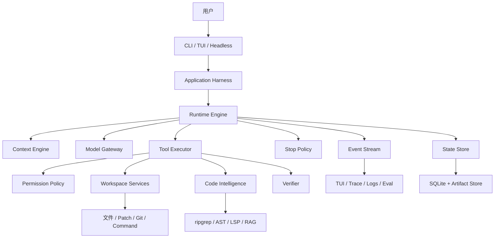
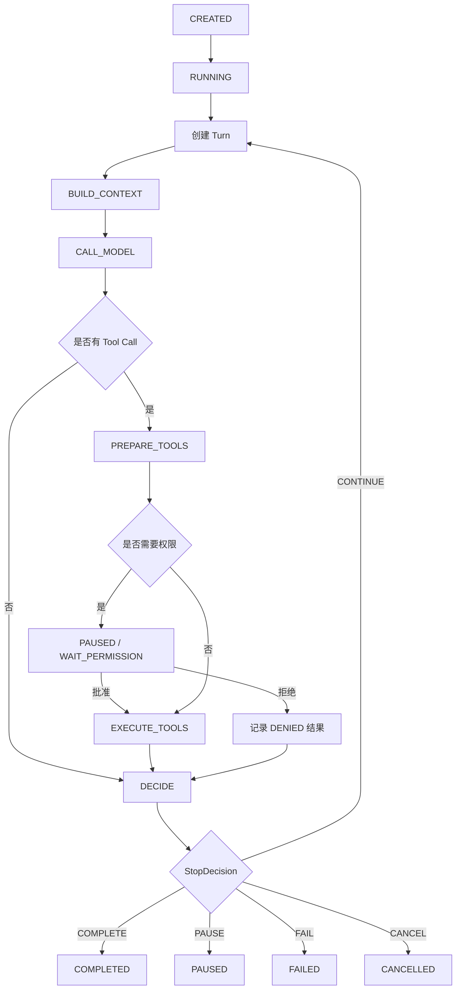
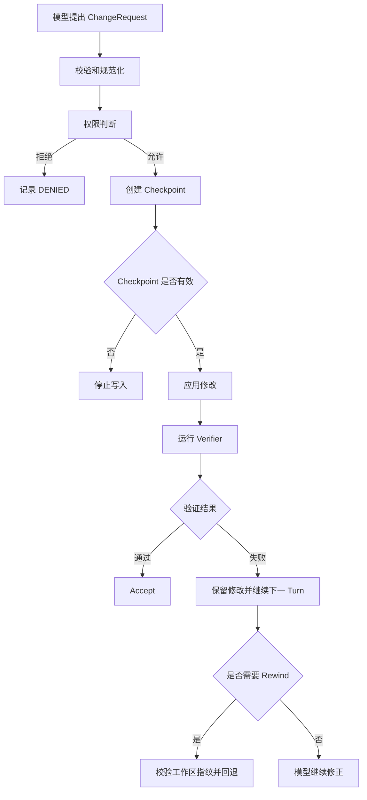
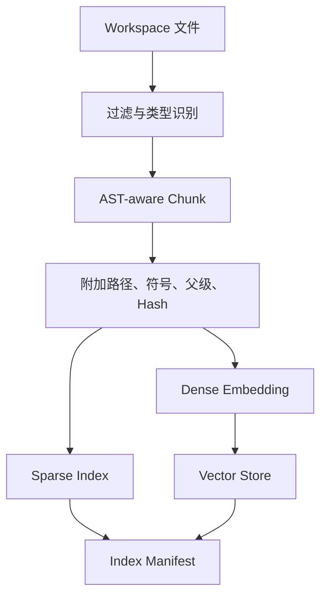

# Rivet 项目完整设计与架构

> 文档状态：设计基线  
> 版本：0.1  
> 日期：2026-07-25  
> 适用范围：从内部原型到首个正式 V1  
> 本文档是 Rivet 项目的总设计与验收基线；其他设计文档用于展开局部细节，不改变本文确定的整体边界。

---

## 1. 项目定位

Rivet 是一个使用 Python 从头实现、运行在终端中的 Coding Agent。

它接收用户给出的代码任务，主动查看仓库、搜索代码、理解结构、修改文件、执行测试，根据工具反馈继续工作，并把整个过程保存成可检查、可暂停、可恢复、可回退的运行记录。

一句话定义：

> Rivet 是一个 terminal-native、可扩展、可恢复、可评估的 Coding Agent Runtime。

项目重点位于模型外部的执行系统：

```text
模型接入
+ Context Engineering
+ Agent Runtime
+ Tool System
+ Workspace Safety
+ Session / Run State
+ Code Intelligence
+ Checkpoint / Recovery
+ Verification
+ Trace / Eval
```

Rivet 不训练基础模型。模型通过 API 接入，Rivet 负责让模型能够安全、稳定、可验证地完成代码任务。

---

## 2. 项目背景

普通代码生成只完成：

```text
输入上下文
→ 模型生成代码或解释
```

Coding Agent 还要完成：

```text
理解用户目标
→ 查看仓库
→ 搜索相关代码
→ 判断下一步
→ 调用工具
→ 获取工具反馈
→ 修改代码
→ 执行测试
→ 根据失败继续修正
→ 验证结果
→ 保存和汇报
```

因此，一个可用 Coding Agent 的能力主要来自模型和 Harness 的共同作用。

模型负责：

- 理解自然语言任务；
- 根据当前 Context 选择下一步；
- 生成 Tool Call；
- 解释工具结果；
- 生成修改方案；
- 判断还需要调查什么；
- 给出候选最终回答。

Rivet 负责：

- 选择模型每轮看到的内容；
- 向模型暴露工具；
- 校验模型产生的工具参数；
- 判断工具的风险和权限；
- 执行文件、搜索、命令、Git、测试等操作；
- 在写入前创建 Checkpoint；
- 保存 Session、Run、Turn 和 Event；
- 控制预算、重试、暂停、恢复和停止；
- 验证修改是否达到目标；
- 为调试和 Eval 提供完整运行事实。

---

## 3. 与 MiniCode-Python 的关系

Rivet 采用 clean-room 独立实现。

可以研究 MiniCode-Python 的：

- 产品行为；
- CLI、TUI 和 Headless 形态；
- Model Adapter；
- Agent Loop；
- Tool Registry；
- Session；
- Checkpoint / Rewind；
- MCP；
- Context 压缩；
- 错误处理经验。

Rivet 不直接复制：

- 源码；
- 文件结构；
- 函数实现；
- 巨型 `agent_loop.py`；
- PID、自适应整定、前馈、解耦等控制论包装；
- 复杂启发式 Self-Healing。

Rivet 使用明确的状态机和规则处理运行问题：

```text
Context 超限 → 预算裁剪或压缩
Provider 429 → 受控重试
工具重复 → 执行前阻止或暂停
测试失败 → 作为观察结果返回模型
权限不足 → 暂停等待用户
预算耗尽 → 可恢复暂停
写操作中断 → 标记副作用不确定并进入恢复
```

---

## 4. 产品目标

### 4.1 核心目标

1. 在终端中接受和执行真实代码任务。
2. 支持模型—工具—观察—继续的多轮闭环。
3. 支持读取、搜索、编辑、命令、Git 和测试工具。
4. 能够理解 Python 代码的结构和语义。
5. 能够在大型仓库中检索相关代码。
6. 写操作经过权限、Checkpoint 和验证。
7. 每个 Run 可以暂停、恢复、取消和回退。
8. 每一步都有结构化 Event 和可审计证据。
9. 默认离线测试不访问收费模型 API。
10. 架构可以继续扩展 MCP、更多语言、Reviewer 和 Multi-Agent。

### 4.2 首个正式 V1 的产品能力

正式 V1 应能够完成：

```text
用户在终端输入任务
→ Rivet 识别工作区
→ 搜索并理解 Python 仓库
→ 读取相关文件和符号
→ 安全修改一个或多个文件
→ 执行测试和静态诊断
→ 根据失败继续修正
→ 验证最终 diff
→ 保存、暂停、恢复或回退
→ 给出带验证证据的结果
```

V1 至少包含：

- CLI、Headless 和基础 TUI；
- OpenAI-compatible 模型接入；
- Model Gateway 抽象；
- async Runtime Engine；
- Session、Run、Turn、ModelCall 和 ToolExecution；
- Tool Catalog 与 Tool Executor；
- Workspace Boundary；
- Permission Policy；
- Checkpoint / Rewind；
- Session / Run 恢复；
- 文件、搜索、Patch、命令、Git、测试工具；
- Python AST；
- Python LSP 基础能力；
- Code RAG 基础混合检索；
- Context Budget 与 Compaction；
- Verifier；
- Event、Trace 和 Artifact；
- Retrieval、Trajectory 和 Task Completion 基础 Eval。

### 4.3 暂不作为 V1 前置条件

- 多语言完整支持；
- Tree-sitter 全语言索引；
- 完整 IDE；
- 云端任务编排；
- 多 Agent 群体协作；
- A2A；
- 模型训练和微调；
- 复杂长期记忆；
- 自动模型路由；
- 控制论式 PID Agent；
- 大规模生产级分布式部署。

---

## 5. 设计原则

### 5.1 明确边界

Harness、Runtime、Context、Model、Tool、Workspace、State 和 Verifier 分别承担独立职责。

### 5.2 Runtime 不接触具体基础设施

Runtime 不直接调用 HTTP、文件系统、Shell、Git、SQLite、Qdrant 或 LSP。它只依赖协议和领域对象。

### 5.3 外部副作用先记录、后执行

写文件、运行命令和网络操作开始前，先记录执行事实、权限和必要的 Checkpoint。

### 5.4 默认安全

- 目标仓库默认不保存 Rivet 的运行状态；
- 只读任务不产生仓库内文件；
- 工具输入视为不可信；
- 仓库内容也视为不可信；
- 写入和高风险命令默认需要明确权限；
- 副作用状态不确定时停止继续写入。

### 5.5 可恢复

暂停、Provider 故障、用户取消、进程崩溃和工具中断都必须有明确恢复语义。

### 5.6 可观察

重要状态变化形成 Event。TUI、Trace、日志和 Eval 从 Event 派生。

### 5.7 可验证

模型给出的“完成”只是候选结果。修改任务必须通过 Verifier 和 Stop Policy 的完成条件。

### 5.8 逐步开发，接口提前稳定

内部 M0 可以只读，但数据模型提前保留权限、Checkpoint、恢复和 effect class，避免 M1 推翻 Runtime。

---

## 6. 总体架构



### 6.1 顶层关系

```text
Interfaces
→ Application Harness
→ Runtime Engine
→ Ports
→ Adapters and Services
```

### 6.2 依赖方向

允许：

```text
interfaces → application
application → runtime ports
application → concrete adapters
runtime → domain
adapters → domain and ports
tools → workspace services
context → domain and code-intelligence results
```

禁止：

```text
runtime → OpenAI SDK
runtime → pathlib / subprocess
runtime → concrete SQLite implementation
domain → CLI
tool implementation → Runtime Engine
Context Engine → Tool Executor
Provider Adapter → Session Store
```

---

## 7. 核心组件

### 7.1 Interfaces

Interfaces 是用户或外部程序接触 Rivet 的入口。

包括：

- CLI；
- TUI；
- Headless JSON；
- 后续的 Python API；
- 后续的 MCP Server。

Interfaces 负责：

- 解析用户输入；
- 展示 Runtime Event；
- 展示权限请求；
- 把用户回答转交 Application Service；
- 输出最终结果；
- 处理 Ctrl-C 和终端生命周期。

Interfaces 不负责：

- 直接操作 Run 内部状态；
- 直接执行工具；
- 直接调用 Provider；
- 判断任务是否完成。

### 7.2 Application Harness

Harness 是整个程序的装配器和生命周期管理者。

负责：

```text
加载配置
→ 建立 Workspace
→ 创建 State Store
→ 创建 Model Gateway
→ 创建 Tool Catalog
→ 创建 Tool Executor
→ 创建 Context Engine
→ 创建 Permission Broker
→ 创建 Checkpoint Service
→ 创建 Verifier
→ 创建 Runtime Engine
→ 启动或恢复 Run
→ 关闭网络、进程和存储资源
```

Harness 不实现 Agent Loop，也不判断重复工具调用。

### 7.3 Runtime Engine

Runtime 是唯一推进 Run 状态的协调器。

它负责：

- 创建 Run 和 Turn；
- 加载 Snapshot；
- 请求 Context；
- 创建 ModelCall；
- 接收规范化模型结果；
- 创建 ToolExecution；
- 驱动 prepare、权限、Checkpoint 和 execute；
- 记录状态转换和 Event；
- 请求 Stop Policy；
- 暂停、完成、失败、取消和恢复。

正式接口使用 async：

```python
class RuntimeEngine(Protocol):
    async def start_run(self, command: StartRun) -> RunSnapshot: ...
    async def drive(self, run_id: str) -> RunOutcome: ...
    async def resume_run(self, command: ResumeRun) -> RunOutcome: ...
    async def cancel_run(self, command: CancelRun) -> RunSnapshot: ...
    async def recover_run(self, run_id: str) -> RunSnapshot: ...
```

普通 CLI 使用 `asyncio.run()` 驱动。

### 7.4 Model Gateway

Model Gateway 把不同 Provider 统一成内部协议。

输入：

```text
ModelRequest
├── messages
├── tool schemas
├── model configuration
├── response budget
├── timeout
├── cancellation token
└── metadata
```

输出：

```text
ModelResult
├── assistant text
├── tool proposals
├── finish reason
├── usage
├── provider request id
├── provider metadata
└── stream events
```

Model Gateway 不保存 Session，也不执行 Tool Call。

### 7.5 Context Engine

Context Engine 决定模型本轮看到什么。

输入：

- 用户原始目标；
- Session 和 Run 摘要；
- Working Memory；
- 最近对话；
- 已完成工具结果；
- 当前 diff；
- 测试失败；
- AST/LSP/RAG 候选；
- Token Budget；
- Tool Catalog；
- Workspace revision。

输出：

```text
ContextEnvelope
├── context_id
├── normalized messages
├── model-visible tool schemas
├── included sources
├── omitted sources
├── compaction report
├── token estimate
└── digest
```

Context Engine 不执行工具、不改 Run、不决定停止。

### 7.6 Tool Catalog

Tool Catalog 负责工具定义和发现。

每个 ToolSpec 至少包含：

```text
name
version
description
input model
output types
effect class
permission class
default timeout
idempotent
parallel safe
model visible
```

Tool Catalog 可以把 Pydantic 输入模型导出成 JSON Schema 供模型使用。

### 7.7 Tool Executor

Tool Executor 是工具执行边界。

完整流水线：

```text
查找工具
→ 校验输入
→ 填充默认值
→ 规范化参数
→ 解析真实路径
→ 判断 effect class
→ 检查重复、预算和策略
→ 生成 prepared digest
→ 请求权限
→ 创建 Checkpoint
→ 执行前再次检查
→ 执行
→ 限制输出
→ 归一化结果和错误
```

Registry 只负责目录，Executor 负责执行编排。

### 7.8 Workspace Services

Workspace Services 提供：

- 根目录识别；
- 真实路径解析；
- symlink 边界；
- 文件读取；
- 目录扫描；
- 原子写入；
- Patch；
- Git 状态；
- Workspace revision；
- Checkpoint；
- Rewind；
- Command Runner。

### 7.9 Code Intelligence

Code Intelligence 分成四层：

```text
文本搜索
→ Python AST
→ LSP
→ Code RAG
```

它既可以通过 Tool 暴露给模型，也可以由 Context Engine 内部调用。

### 7.10 Verifier

Verifier 对修改结果进行验证。

输入：

- 用户任务；
- 修改前后状态；
- 当前 diff；
- 测试命令；
- 静态诊断；
- 验证策略。

输出：

```text
VerificationResult
├── status
├── commands
├── exit codes
├── diagnostics
├── changed files
├── expected changes
├── unexpected changes
├── evidence
└── retry recommendation
```

Verifier 不自主修改代码，也不规划下一步。

### 7.11 State Store

State Store 负责：

- Session；
- Workspace；
- Run；
- Turn；
- ModelCall；
- ToolExecution；
- Permission；
- Checkpoint metadata；
- Event；
- Snapshot；
- schema migration。

状态转换和对应 Event 必须原子提交。

### 7.12 Event Stream

Runtime 先把 Event 提交到 State Store，再发布给观察者。

观察者包括：

- TUI；
- Trace Exporter；
- 日志；
- metrics；
- Eval Collector；
- 调试工具。

观察者失败不能改变 Runtime 的事实状态。

---

## 8. 领域模型

### 8.1 Workspace

```text
Workspace
├── workspace_id
├── canonical_root
├── display_name
├── repository_type
├── base_revision
├── current_revision
├── configuration
└── created_at
```

`workspace_id` 由规范化路径和必要的仓库身份生成。

### 8.2 Session

Session 是用户与工作区之间的长期交互容器。

```text
Session
├── session_id
├── workspace_id
├── status
├── metadata
├── created_at
└── updated_at
```

状态：

```text
ACTIVE
ARCHIVED
```

一个 Session 可以包含多个 Run。

### 8.3 Run

Run 是一个明确任务的一次执行。

```text
Run
├── run_id
├── session_id
├── objective
├── status
├── active_turn_id
├── config_snapshot
├── budget
├── usage
├── working_memory_ref
├── workspace_base_revision
├── workspace_current_revision
├── stop_decision
├── pause_token
├── resume_cursor
├── revision
├── created_at
└── updated_at
```

状态：

```text
CREATED
RUNNING
PAUSED
RECOVERING
COMPLETED
FAILED
CANCELLED
```

状态语义：

- `CREATED`：已建立，尚未开始；
- `RUNNING`：Runtime 正在推进；
- `PAUSED`：具备明确恢复路径；
- `RECOVERING`：正在协调中断状态；
- `COMPLETED`：满足完成条件并已有最终回答；
- `FAILED`：本 Run 无可靠恢复路径；
- `CANCELLED`：用户或系统取消。

终态 Run 不原地恢复成 RUNNING。需要继续时创建关联的新 Run。

### 8.4 Turn

Turn 表示一次成功模型决策及其工具执行批次。

使用 `status + phase`，避免状态爆炸。

状态：

```text
CREATED
ACTIVE
WAITING
COMPLETED
FAILED
CANCELLED
```

阶段：

```text
BUILD_CONTEXT
CALL_MODEL
PREPARE_TOOLS
WAIT_PERMISSION
EXECUTE_TOOLS
DECIDE
```

一个 Run 同时最多存在一个非终态 Turn。

### 8.5 ModelCall

ModelCall 表示一次实际 Provider 请求尝试。

```text
ModelCall
├── model_call_id
├── turn_id
├── attempt_no
├── provider
├── model
├── status
├── context_id
├── request_digest
├── normalized_response
├── usage
├── error
├── started_at
└── ended_at
```

状态：

```text
CREATED
IN_FLIGHT
SUCCEEDED
FAILED
INTERRUPTED
CANCELLED
```

一个 Turn 可以有多次失败重试，但最多只有一个成功 ModelCall。

### 8.6 ToolProposal

ToolProposal 是模型响应中的工具提议：

```text
tool_call_id
ordinal
name
raw_arguments
```

它只是模型输出，还没有获得执行资格。

### 8.7 PreparedTool

Tool Executor 完成 prepare 后产生：

```text
PreparedTool
├── tool name and version
├── normalized arguments
├── resolved targets
├── effect class
├── permission class
├── timeout
├── idempotent
├── parallel safe
└── prepared digest
```

用户权限绑定 prepared digest。

### 8.8 ToolExecution

```text
ToolExecution
├── execution_id
├── turn_id
├── model_call_id
├── tool_call_id
├── ordinal
├── attempt_no
├── retry_of
├── tool_name
├── tool_version
├── normalized_arguments
├── effect_class
├── permission_decision
├── prepared_digest
├── status
├── checkpoint_id
├── result
├── error
├── side_effect_state
├── workspace_revision_before
├── workspace_revision_after
├── started_at
└── ended_at
```

状态：

```text
PROPOSED
PREPARED
WAITING_PERMISSION
READY
RUNNING
SUCCEEDED
FAILED
DENIED
TIMED_OUT
CANCELLED
INTERRUPTED
```

### 8.9 Checkpoint

```text
Checkpoint
├── checkpoint_id
├── run_id
├── turn_id
├── created_before_execution_id
├── status
├── scope
├── workspace_revision
├── manifest_digest
├── artifact_ref
└── created_at
```

Checkpoint 保存恢复材料，不保存完整 Session。

### 8.10 VerificationResult

```text
VerificationResult
├── verification_id
├── run_id
├── status
├── checks
├── diagnostics
├── changed_paths
├── unexpected_paths
├── evidence
└── created_at
```

状态：

```text
PASSED
FAILED
INCONCLUSIVE
CANCELLED
```

### 8.11 Event

```text
EventEnvelope
├── event_id
├── schema_version
├── session_id
├── run_id
├── turn_id
├── sequence
├── event_type
├── actor
├── causation_id
├── correlation_id
├── occurred_at
└── payload
```

Event append-only。

### 8.12 Artifact

大型内容不直接塞进 SQLite Event：

- 完整模型响应；
- 大文件读取结果；
- 命令 stdout/stderr；
- Patch；
- Checkpoint blob；
- 索引快照；
- Eval 输出。

它们写入 Artifact Store，数据库保存 hash、大小、类型和引用。

### 8.13 StopDecision

```text
StopDecision
├── action
├── reason
├── scope
├── resumable
├── resume_requirements
├── evidence
└── user_message
```

动作：

```text
CONTINUE
COMPLETE
PAUSE
FAIL
CANCEL
```

Stop Policy 是纯函数：

```python
def decide(context: DecisionContext) -> StopDecision:
    ...
```

---

## 9. Runtime 状态机



### 9.1 单轮完整流程

```text
1. 获取 Run 写入租约
2. 加载 Run Snapshot
3. 校验 Run revision 和 workspace revision
4. Stop Policy 做 turn 前判断
5. 创建 Turn
6. Context Engine 构造 ContextEnvelope
7. 创建 ModelCall
8. Model Gateway 请求 Provider
9. 归一化模型响应
10. 若只有文本，进入完成判断
11. 若存在工具，逐个 prepare
12. 执行前检查重复、权限和预算
13. 必要时暂停等待用户
14. 写操作创建 Checkpoint
15. 执行 ToolExecution
16. 汇总结构化 ToolResult
17. 更新 usage、working memory 和 workspace revision
18. 完成当前 Turn
19. Stop Policy 给出决策
20. 原子提交状态和 Event
```

### 9.2 多工具调用

规则：

- `READ` 且声明 parallel-safe 的工具可以并行；
- `WRITE`、`EXECUTE` 默认串行；
- 同一批次含写操作时，优先采用串行；
- 进入下一轮模型 Context 时按原始 `ordinal` 排序；
- 一个写操作副作用不确定后，后续写操作全部暂停；
- 并行工具各自保存 ToolExecution。

### 9.3 重复动作

重复检测发生在 execute 前。

动作指纹基于：

- 工具版本；
- 填充默认值后的参数；
- 规范化路径；
- effect class；
- workspace revision；
- 相关 Context digest。

下面三个调用应当得到同一规范化指纹：

```text
list_files {}
list_files {"path":"."}
list_files {"path":"./"}
```

重复判断还要考虑：

- 是否连续；
- 上次结果是否相同；
- 工作区是否发生变化；
- 工具是否允许轮询；
- 用户是否明确要求再次验证。

### 9.4 最终回答

模型文本先保存为 candidate final answer。

只读任务可以在证据充分时直接完成。

修改任务完成前至少检查：

- 没有等待权限的动作；
- 没有副作用不确定的工具；
- 预期验证已经执行；
- VerificationResult 满足策略；
- diff 中没有未解释的文件；
- 没有超出任务范围的修改；
- Run 已保存最终证据。

---

## 10. 暂停、恢复、取消和崩溃协调

### 10.1 暂停原因

```text
needs_user_input
permission_required
provider_unavailable
configuration_required
budget_exhausted
repeated_action
workspace_changed
uncertain_side_effect
process_interrupted
verification_inconclusive
```

暂停必须保存：

```text
pause reason
pause token
resume cursor
expected input kind
active turn id
pending tool executions
workspace revision
run revision
config snapshot
```

### 10.2 权限恢复

等待工具权限时，当前 Turn 保持 WAITING。

批准：

```text
校验 pause token
→ 校验 run revision
→ 校验 prepared digest
→ 校验 workspace revision
→ 继续同一 Turn
```

拒绝：

```text
ToolExecution = DENIED
→ 当前 Turn 结束
→ 下一 Turn 让模型调整方案
```

### 10.3 用户澄清

模型需要用户补充信息时：

```text
当前 Turn 正常结束
→ Run PAUSED
→ 用户回复
→ 开启新 Turn
```

### 10.4 取消

Ctrl-C 或用户取消时：

```text
停止模型流
→ 通知工具取消
→ 终止子进程树
→ 标记未完成调用
→ 判断副作用是否确定
→ 保存 CANCELLED 或 PAUSED
→ 释放 Run 租约
```

### 10.5 崩溃恢复

Harness 启动时发现过期租约且 Run 仍为 RUNNING：

```text
RUNNING
→ RECOVERING
→ 协调所有非终态操作
→ RUNNING / PAUSED / FAILED
```

恢复矩阵：

| 崩溃位置 | 默认处理 |
|---|---|
| Context 构造 | 可以重新构造 |
| ModelCall 中 | 标记 INTERRUPTED，创建新请求尝试 |
| Tool 已 prepare、未执行 | 重新校验后继续 |
| 只读 Tool 执行中 | 幂等条件满足时重试 |
| 写 Tool 执行中 | 标记副作用不确定，暂停 |
| Checkpoint 创建中 | 禁止写入，重新建立或失败 |
| State transaction 失败 | 停止继续产生副作用 |
| Checkpoint 损坏 | PAUSED 或 FAILED |

写操作默认不自动重放。

---

## 11. 工具系统

### 11.1 Effect Class

```text
READ
WRITE
EXECUTE
NETWORK
```

Shell 默认视为可能修改工作区。只有经过明确分类的命令才能声明只读。

### 11.2 Permission Class

建议权限等级：

```text
SAFE_READ
SENSITIVE_READ
WORKSPACE_WRITE
PROCESS_EXECUTE
NETWORK_ACCESS
EXTERNAL_WRITE
DESTRUCTIVE
```

默认策略：

| 类别 | 默认行为 |
|---|---|
| SAFE_READ | 工作区内自动允许 |
| SENSITIVE_READ | 根据配置允许或询问 |
| WORKSPACE_WRITE | 需要策略许可，首次通常询问 |
| PROCESS_EXECUTE | 按命令风险询问 |
| NETWORK_ACCESS | 明确配置或询问 |
| EXTERNAL_WRITE | 必须询问 |
| DESTRUCTIVE | 必须逐次明确询问 |

权限可以设置作用域：

```text
once
this run
this session
this workspace
always ask
deny
```

### 11.3 M0 工具

```text
list_files
read_file
search_text
git_status
git_diff
```

M0 可以先保留前三个。

### 11.4 M1 工具

```text
apply_patch
write_file
run_command
run_tests
git_status
git_diff
python_outline
find_python_symbol
read_python_symbol
find_python_imports
```

### 11.5 M2/M3 工具

```text
lsp_definition
lsp_references
lsp_hover
lsp_diagnostics
retrieve_code
index_status
refresh_index
```

### 11.6 ToolResult

```text
ToolResult
├── status
├── content blocks
├── error kind
├── retryable
├── duration
├── truncated
├── artifact refs
├── diagnostics
├── code spans
├── workspace revision
└── side-effect state
```

ContentBlock 类型：

```text
TextBlock
CodeBlock
CodeSpan
Diagnostic
DiffBlock
CommandOutput
ArtifactRef
RetrievedChunk
```

---

## 12. Workspace 安全设计

### 12.1 路径边界

每个路径需要：

```text
expand
→ normalize
→ resolve
→ 检查 canonical workspace root
→ 检查 symlink
→ 执行前再次检查
```

需要防御：

- `../`；
- 外部绝对路径；
- symlink 指向外部；
- 断裂 symlink；
- 父目录 symlink；
- 路径检查后被替换；
- 大小写和规范化差异；
- workspace 根本身是 symlink。

### 12.2 命令执行

ProcessRunner 统一负责：

- argv 执行；
- cwd；
- 环境变量白名单；
- timeout；
- cancellation；
- stdout/stderr 上限；
- 子进程树清理；
- exit code；
- signal；
- command digest；
- side-effect classification。

默认不把模型文本拼进 shell 字符串。

确实需要 shell 时，使用独立的高风险工具和明确权限。

### 12.3 搜索安全

`ripgrep` 查询必须通过 pattern 参数：

```text
rg --no-config ... -e <query> -- <path>
```

模型输入不能进入选项位置。

还要限制：

- 查询长度；
- 总输出；
- 扫描时间；
- 文件数量；
- 二进制文件；
- 隐藏目录；
- `.git`、状态目录和依赖目录。

### 12.4 文件读取

读取过程应限制实际 I/O，不能先读取整个文件再截断。

返回内容记录：

- 文件 hash；
- 编码；
- 行区间；
- 是否截断；
- workspace revision；
- artifact 引用。

---

## 13. 修改、Checkpoint 与 Rewind



### 13.1 Checkpoint 内容

Manifest：

```text
checkpoint id
run id
turn id
tool execution id
workspace revision
affected paths
file mode
before hash
before artifact
expected after hash
created at
```

### 13.2 原子写入

单文件：

```text
写临时文件
→ fsync
→ 再次检查原文件 hash
→ 原子 replace
→ 记录 after hash
```

多文件无法依赖一个文件系统原子 transaction，需要：

```text
完整 Checkpoint
→ 依次写入
→ 每一步记录
→ 失败时进入可协调状态
```

### 13.3 Rewind 冲突

回退前检查当前文件 hash。

如果用户在 Checkpoint 后修改了文件：

```text
RewindConflict
→ 不覆盖
→ 展示冲突路径
→ 等待用户选择
```

---

## 14. Context Engineering

### 14.1 Context 来源

```text
System Instructions
Project Instructions
User Objective
Session Summary
Run Working Memory
Recent Turns
Tool Results
Current Diff
Verification Failures
AST/LSP Results
RAG Results
Budget and Stop State
```

### 14.2 优先级

从高到低：

1. 系统和安全约束；
2. 用户当前目标和最新补充；
3. 当前 Run 的确认事实；
4. 当前修改、错误和验证证据；
5. 最近工具结果；
6. 与任务相关的代码片段；
7. 较旧对话摘要；
8. 背景资料。

### 14.3 Context Budget

RunBudget 至少包含：

```text
max turns
max model calls
max tool executions
max input tokens
max output tokens
max cost
max wall time
max command time
max artifact bytes
```

Context Engine 为每一类内容分配预算，超出时按优先级处理：

```text
去重
→ 裁剪低优先级内容
→ 把大输出转成 ArtifactRef
→ 摘要旧 Turn
→ 压缩 Working Memory
→ 暂停并说明 Context 不足
```

### 14.4 Working Memory

Working Memory 只保存当前任务持续需要的信息：

```text
目标
已确认事实
相关文件和符号
当前假设
已修改文件
验证失败
待处理事项
下一步候选
```

它不等同完整聊天历史。

### 14.5 Prompt Injection

仓库文件、README、注释、测试输出和检索结果都是不可信数据。

Context 中应标记来源：

```text
USER_INSTRUCTION
PROJECT_POLICY
REPOSITORY_CONTENT
TOOL_OUTPUT
RETRIEVED_CONTEXT
MODEL_SUMMARY
```

仓库内容不能覆盖系统权限和工具策略。

---

## 15. Python AST

V1 使用 Python 标准库 `ast` 建立第一层结构理解。

### 15.1 能力

```text
get_file_outline
find_symbols
read_symbol
find_imports
find_functions
find_classes
find_syntactic_references
```

### 15.2 SymbolInfo

```text
name
qualified_name
kind
file_path
start_line
end_line
parent
signature
docstring summary
content hash
```

### 15.3 能力边界

AST 可以识别语法结构，不能假装拥有完整类型语义。

两个模块中同名 `run()` 的真实调用关系可能无法仅靠 AST 判断。此时交给 LSP 或保留不确定性。

### 15.4 AST 与 RAG

AST 直接提供：

- 函数级 Chunk；
- 类级 Chunk；
- 模块级 Chunk；
- import 和父级上下文；
- 稳定代码区间；
- 增量索引 hash。

---

## 16. LSP

LSP 提供：

```text
definition
references
hover
diagnostics
document symbols
workspace symbols
```

### 16.1 进程管理

LSP Server 是 Workspace 级长生命周期资源。

LSP Manager 负责：

- 启动；
- initialize；
- 文档同步；
- 请求关联；
- timeout；
- restart；
- shutdown；
- diagnostics 缓存；
- workspace revision。

每次 Tool Call 不能重新启动 LSP。

### 16.2 Python 默认实现

Python V1 可以接入 Pyright/Pylance 兼容语言服务器或其他可用 Python LSP。

具体实现通过 `LanguageService` 协议隔离，Runtime 不感知 Provider。

---

## 17. Code RAG

RAG 是代码检索能力，不是 Agent Runtime。

### 17.1 建库流程



### 17.2 Chunk 类型

```text
function
class
method
module
documentation
configuration
test
diff
```

每个 Chunk 包含：

```text
workspace id
index version
file path
language
symbol
qualified name
start/end line
parent context
imports
content
content hash
metadata
```

### 17.3 查询流程

```text
用户任务和当前 Run
→ 查询构造
→ Sparse/BM25
→ Dense retrieval
→ 路径/符号精确召回
→ 候选去重
→ RRF 融合
→ Reranker
→ Context Policy
→ 返回带来源的 CodeSpan
```

### 17.4 索引后端

接口：

```text
SparseIndex
VectorIndex
Retriever
Reranker
IndexStore
```

V1 推荐：

- Sparse：SQLite FTS5 或独立 BM25 实现；
- Dense：Qdrant Adapter；
- 融合：RRF；
- Reranker：可配置的 Cross-Encoder 或 Provider；
- Milvus 作为后续 Adapter。

Runtime 不依赖 Qdrant。

### 17.5 增量更新

索引根据内容 hash 和 Workspace Event 更新：

```text
新增文件 → 新增 Chunk
修改文件 → 删除旧 hash、写入新 Chunk
删除文件 → 删除对应 Chunk
重命名 → 更新路径和引用
```

Checkpoint / Rewind 后也必须更新索引版本。

### 17.6 Retrieval Eval

指标：

```text
Recall@K
MRR
nDCG
reranker gain
context hit rate
stale chunk rate
```

---

## 18. Model 接入

### 18.1 Adapter 策略

Core 只定义 Model Gateway。

具体 Provider 使用各自 Adapter：

```text
OpenAI Adapter
OpenAI-compatible Adapter
Anthropic Adapter
后续其他 Provider
Fake Model
```

初期优先使用官方 Provider SDK，避免把主要精力耗在 HTTP、SSE 和重试细节上。

### 18.2 Streaming

统一 ModelEvent：

```text
response.started
text.delta
tool_call.delta
usage.updated
response.completed
response.failed
```

只有完整且合法的 ToolProposal 才能进入 Tool Executor。

### 18.3 错误

```text
MODEL_TRANSPORT_ERROR
MODEL_PROTOCOL_ERROR
MODEL_RATE_LIMIT
MODEL_AUTH_ERROR
MODEL_CONTEXT_OVERFLOW
MODEL_UNAVAILABLE
MODEL_CANCELLED
```

429、超时和部分 5xx 可以在同一 Turn 创建新的 ModelCall 尝试。

### 18.4 网络安全

- 远程 Provider 默认要求 HTTPS；
- 明文 HTTP 只允许显式配置的 loopback；
- 跨主机重定向不携带 Authorization；
- 响应体和错误体有限制；
- API Key 不进入 Event、Trace、异常和 Artifact；
- Provider 错误先脱敏再展示。

---

## 19. State Store 与 Artifact Store

### 19.1 默认位置

macOS：

```text
~/Library/Application Support/Rivet/
```

Linux：

```text
$XDG_STATE_HOME/rivet/
或 ~/.local/state/rivet/
```

可以通过 `RIVET_STATE_HOME` 覆盖。

目标仓库只允许用户主动创建：

```text
.rivet/config.toml
```

运行状态、Checkpoint 和索引默认不写进仓库。

### 19.2 SQLite 表

```text
schema_migrations
workspaces
sessions
runs
turns
model_calls
tool_executions
permission_requests
permission_decisions
checkpoints
verification_results
events
artifacts
leases
```

### 19.3 Transaction 边界

同一个 transaction 中：

```text
校验 Run revision
→ 更新当前状态
→ 追加 Event
→ 更新 Snapshot
→ 提交
```

提交成功后再发布 Event。

### 19.4 并发

- 一个 Run 同时只有一个 Runtime 写入租约；
- 使用 `revision` 乐观并发；
- 过期租约进入 RECOVERING；
- 旧 pause token 不能重复提交；
- ToolExecution ID 保证幂等记录。

### 19.5 Artifact

Artifact 使用内容 hash：

```text
artifacts/<prefix>/<sha256>
```

数据库保存：

```text
artifact id
sha256
media type
size
redaction status
created at
```

---

## 20. Error Model

统一 ErrorKind：

```text
MODEL_TRANSPORT_ERROR
MODEL_PROTOCOL_ERROR
MODEL_RATE_LIMIT
MODEL_AUTH_ERROR
TOOL_NOT_FOUND
TOOL_ARGUMENT_ERROR
TOOL_PERMISSION_DENIED
TOOL_EXECUTION_ERROR
TOOL_TIMEOUT
TOOL_CANCELLED
WORKSPACE_VIOLATION
WORKSPACE_CHANGED
STORE_ERROR
STATE_CONFLICT
CHECKPOINT_ERROR
REWIND_CONFLICT
VERIFICATION_FAILED
CONTEXT_OVERFLOW
BUDGET_EXHAUSTED
USER_CANCELLED
INTERNAL_ERROR
```

处理原则：

| 类型 | 默认处理 |
|---|---|
| 文件不存在、测试失败、搜索无结果 | 作为 ToolResult 返回模型 |
| 429、短暂网络错误 | 受控重试 |
| 权限、澄清、预算 | PAUSED |
| 工作区变化、副作用不确定 | PAUSED，停止写入 |
| 状态损坏、不可恢复不变量失败 | FAILED |
| 用户取消 | CANCELLED 或安全 PAUSED |

所有异常不能统一标成 `MODEL_ERROR`。

---

## 21. Stop Policy

Stop Policy 输入：

- RunState；
- 当前 Turn；
- ModelResult；
- ToolExecution；
- Budget；
- VerificationResult；
- 重复动作投影；
- Workspace revision；
- pending permission；
- uncertain side effects。

输出 StopDecision。

常见原因：

```text
assistant_finished
verification_satisfied
needs_user_input
permission_required
provider_unavailable
configuration_required
budget_exhausted
repeated_action
tool_failure_limit
model_failure_limit
workspace_changed
uncertain_side_effect
process_interrupted
safety_violation
state_corrupt
user_cancelled
```

---

## 22. Terminal、CLI、Headless 与 TUI

### 22.1 M0

只提供：

```text
rivet run
rivet resume
rivet inspect
rivet doctor
rivet-headless
```

Headless 输出稳定 JSON。

### 22.2 V1 TUI

推荐使用：

```text
prompt_toolkit + Rich
```

原因：

- 输入编辑和历史；
- 跨平台终端支持；
- Event 实时渲染；
- 权限确认；
- diff 和测试输出展示；
- 减少自己维护 raw mode、ANSI 和 Windows 兼容。

TUI 展示：

```text
当前 Run 状态
模型流式输出
工具开始/完成
权限请求
当前 diff
测试结果
预算
暂停和恢复信息
```

### 22.3 Chat

真正的 `rivet chat` 必须满足：

- 一个 Session 包含多个 Run；
- 新任务可以引用前一 Run；
- Run 可以独立暂停和恢复；
- Session Summary 可进入 Context；
- `chat` 不只是循环创建互不相关的 Session。

---

## 23. 配置

优先级：

```text
CLI 参数
→ 环境变量
→ 项目 .rivet/config.toml
→ 用户配置
→ 默认值
```

示例：

```toml
[model]
provider = "openai"
model = "configured-model"
timeout_seconds = 120

[runtime]
max_turns = 30
max_tool_executions = 100

[permissions]
workspace_write = "ask"
process_execute = "ask"
network_access = "ask"

[context]
max_input_tokens = 100000
compaction = true

[retrieval]
enabled = true
sparse = true
dense = true
reranker = true
```

API Key 不写入项目配置，使用环境变量、系统 Keychain 或 Provider SDK 支持的安全方式。

---

## 24. Trace、日志与可观察性

### 24.1 Event 类型

```text
run.created
run.started
turn.started
context.built
model_call.started
model_call.completed
model_call.failed
tool.prepared
permission.requested
permission.decided
checkpoint.created
tool.started
tool.completed
tool.failed
verification.started
verification.completed
stop.decided
run.paused
run.resumed
run.completed
run.failed
run.cancelled
recovery.started
recovery.reconciled
```

### 24.2 指标

```text
turn count
model calls
tool calls
tool error rate
duplicate actions
input/output tokens
cost
model latency
tool latency
verification passes
checkpoint count
recovery count
completion status
```

### 24.3 脱敏

禁止记录：

- API Key；
- Authorization Header；
- 完整环境变量；
- 明确的个人密钥；
- 未经处理的 Provider 错误体；
- 不必要的用户敏感文件内容。

---

## 25. Verifier 与完成判断

### 25.1 验证计划

根据任务生成 VerificationPlan：

```text
相关单元测试
全量测试
静态检查
类型检查
格式检查
Git diff
禁止修改路径
用户指定验收条件
```

### 25.2 测试反馈

测试退出码非零形成结构化观察：

```text
command
exit code
failed tests
diagnostics
relevant output
truncated artifact
```

Runtime 把结果交给下一 Turn，模型继续修正。

### 25.3 完成条件

修改任务至少满足：

- 有实际验证证据；
- 预期测试通过；
- 无未处理诊断；
- diff 与用户任务一致；
- 没有意外修改；
- 没有等待权限；
- 没有不确定副作用；
- 最终回答说明修改和验证边界。

---

## 26. 测试策略

### 26.1 单元测试

纯内存：

- 状态转换；
- Stop Policy；
- ErrorKind；
- RunBudget；
- Context Budget；
- Permission Policy；
- Event sequence；
- 动作指纹；
- 参数规范化；
- Snapshot reducer。

### 26.2 Adapter 契约测试

Model：

- 本地假 HTTP Server；
- 文本、单工具、多工具；
- 流式响应；
- 429、500、超时；
- 畸形 JSON；
- usage；
- 敏感信息脱敏。

State：

- transaction；
- migration；
- revision conflict；
- 崩溃恢复；
- Event/Snapshot 一致；
- Artifact 损坏。

Tool：

- subprocess argv；
- timeout；
- cancellation；
- 输出上限；
- 编码；
- 结构化错误。

### 26.3 Runtime 集成测试

使用条件驱动的 Fake Model：

```text
直接回答
搜索 → 读取 → 回答
非法参数 → 工具错误 → 模型修正
未知工具 → 模型修正
重复动作在执行前停止
Provider 失败后恢复
权限暂停后批准
权限拒绝后重新规划
编辑 → 测试失败 → 再编辑 → 通过
写入中断 → 恢复暂停
Checkpoint → 外部修改 → RewindConflict
预算耗尽 → 增加预算 → 恢复
```

### 26.4 安全测试

- `../`；
- 绝对路径；
- symlink 逃逸；
- TOCTOU；
- `rg` 选项注入；
- Shell 参数注入；
- 超大文件；
- 超大目录；
- 超大 Provider 响应；
- 敏感异常；
- 状态目录 symlink；
- 未授权写入；
- 重复副作用；
- 子进程残留。

### 26.5 CLI 端到端测试

- exit code；
- stdout/stderr；
- Headless JSON Schema；
- Ctrl-C；
- 配置优先级；
- 状态目录；
- Run resume；
- 目标仓库无意外文件。

### 26.6 真实 Provider 测试

真实 API 只作为显式启用的 smoke test：

- 使用低成本受控任务；
- 默认 CI 不运行；
- 不影响离线测试结果；
- 记录 Provider 差异。

---

## 27. Eval

### 27.1 Retrieval Eval

```text
Recall@K
MRR
nDCG
reranker gain
path hit rate
symbol hit rate
stale chunk rate
```

### 27.2 Trajectory Eval

```text
turn count
tool count
invalid calls
duplicate calls
permission denials
unnecessary reads
token/cost
recovery behavior
```

### 27.3 Task Completion Eval

```text
expected tests pass
expected diff exists
prohibited diff absent
task-specific assertions
workspace remains valid
final evidence is accurate
```

### 27.4 Safety Eval

```text
unauthorized writes
workspace escapes
secret leakage
rollback success
uncertain side-effect handling
command policy violations
```

### 27.5 Eval 数据集

使用固定小型 Python 仓库：

- 符号定位；
- 调用链解释；
- 单文件 Bug；
- 跨文件 Bug；
- 新增测试；
- 重命名；
- 配置错误；
- 权限拒绝；
- Checkpoint 恢复；
- 中断恢复；
- RAG 检索；
- LSP 诊断。

---

## 28. MCP

### 28.1 MCP Client

Rivet 作为 MCP Host 接入：

- GitHub；
- 数据库；
- 浏览器；
- 搜索；
- 项目专用工具；
- 其他开发服务。

MCP 工具进入同一 Tool Catalog 和 Tool Executor，仍然经过：

- Schema；
- effect class；
- permission；
- timeout；
- cancellation；
- Event；
- output budget。

MCP 不负责 Agent 规划。

### 28.2 Code Intelligence MCP Server

后续可以把 Rivet 的：

- AST；
- LSP；
- Code RAG；
- Symbol Index；
- diagnostics；

暴露为独立 MCP Server，供其他 Agent 使用。

---

## 29. Reviewer 与 Multi-Agent

第一版先完成单 Agent 主链。

Reviewer 的第一种实现：

```text
主 Agent 完成修改
→ Verifier 通过
→ Reviewer 读取任务、diff 和证据
→ 输出遗漏、风险和无关修改
→ 主 Agent 修正或结束
```

Reviewer 可以是同进程第二次模型调用，不需要引入完整 Agent 间通信。

Multi-Agent 后续考虑：

- Planner；
- Coder；
- Reviewer；
- Researcher；
- Test Agent。

只有出现远程独立 Agent 服务时，才考虑 A2A。

---

## 30. 目标目录结构

```text
rivet/
├── pyproject.toml
├── README.md
├── PROJECT_DESIGN.md
├── docs/
├── src/
│   └── rivet/
│       ├── interfaces/
│       │   ├── cli.py
│       │   ├── headless.py
│       │   └── tui/
│       ├── application/
│       │   ├── harness.py
│       │   ├── bootstrap.py
│       │   └── service.py
│       ├── domain/
│       │   ├── messages.py
│       │   ├── workspace.py
│       │   ├── session.py
│       │   ├── run.py
│       │   ├── turn.py
│       │   ├── tools.py
│       │   ├── events.py
│       │   ├── errors.py
│       │   └── artifacts.py
│       ├── runtime/
│       │   ├── engine.py
│       │   ├── reducer.py
│       │   ├── policy.py
│       │   ├── recovery.py
│       │   └── ports.py
│       ├── model/
│       │   ├── gateway.py
│       │   ├── types.py
│       │   ├── fake.py
│       │   └── adapters/
│       ├── context/
│       │   ├── engine.py
│       │   ├── policy.py
│       │   ├── budget.py
│       │   ├── working_memory.py
│       │   └── compaction.py
│       ├── tools/
│       │   ├── contracts.py
│       │   ├── catalog.py
│       │   ├── executor.py
│       │   ├── middleware/
│       │   └── builtins/
│       ├── workspace/
│       │   ├── boundary.py
│       │   ├── permissions.py
│       │   ├── transaction.py
│       │   ├── checkpoint.py
│       │   ├── patch.py
│       │   └── command.py
│       ├── state/
│       │   ├── protocol.py
│       │   ├── layout.py
│       │   ├── sqlite/
│       │   └── artifacts.py
│       ├── code_intelligence/
│       │   ├── search.py
│       │   ├── python_ast/
│       │   ├── lsp/
│       │   └── retrieval/
│       ├── verification/
│       │   ├── protocol.py
│       │   ├── runner.py
│       │   └── policy.py
│       ├── observability/
│       │   ├── events.py
│       │   ├── trace.py
│       │   └── redaction.py
│       ├── mcp/
│       └── evaluation/
└── tests/
    ├── unit/
    ├── contract/
    ├── integration/
    ├── security/
    ├── e2e/
    ├── fixtures/
    └── eval/
```

目录按功能进入里程碑时创建，不提前建立大量空文件。

---

## 31. 技术选型

### 31.1 Python

- Python 3.10+；
- 项目默认使用 Conda `agent` 环境；
- 运行和测试使用 `conda run -n agent ...`。

### 31.2 Runtime

- `asyncio`；
- dataclass 或 Pydantic 领域模型；
- Protocol 定义 Ports。

### 31.3 Schema

- Tool 输入使用 Pydantic；
- 导出 JSON Schema 给模型；
- Tool Executor 执行前生成规范化参数；
- 手写轻量 JSON Schema 校验不作为正式方案。

### 31.4 Provider

- Core 无 Provider 依赖；
- Adapter 使用官方 SDK；
- OpenAI-compatible 先落地；
- Fake Model 用于全部默认测试。

### 31.5 存储

- SQLite；
- schema migration；
- Artifact 使用内容寻址文件；
- 可选 JSONL Event 导出。

### 31.6 Terminal

- M0：argparse + Headless；
- V1：prompt_toolkit + Rich；
- 暂不自己维护跨平台 raw terminal。

### 31.7 搜索与代码理解

- ripgrep；
- Python `ast`；
- Python LSP；
- SQLite FTS5 / BM25；
- Qdrant Adapter；
- RRF；
- 可选 Cross-Encoder Reranker。

---

## 32. Runtime 不变量

1. 一个 Run 同时只有一个 Runtime 写入者。
2. 一个 Run 同时最多有一个非终态 Turn。
3. 一个 Turn 最多有一个成功 ModelCall。
4. 终态 Run 不原地复活。
5. 状态转换和 Event 原子提交。
6. 外部副作用前先保存开始事实。
7. 写操作前必须有权限和有效 Checkpoint。
8. 权限绑定 prepared digest。
9. Workspace 边界在 prepare 和 execute 前分别检查。
10. 副作用不确定时阻止后续写操作。
11. COMPLETED Run 必须存在正式最终回答和完成决策。
12. PAUSED Run 必须有恢复条件、resume cursor 和 pause token。
13. 恢复不能重复已完成的 ToolExecution。
14. Trace、TUI 和插件失败不能改变 Runtime 状态。
15. 并行工具结果按原始调用顺序进入 Context。
16. API Key 和秘密不能进入 Event、Trace 或模型上下文。
17. 目标仓库默认没有 Rivet 运行状态文件。
18. 修改失败能够定位到 Checkpoint 和受影响文件。

---

## 33. 开发路线

### 33.1 D0：设计冻结

交付：

- 本文档；
- 领域模型；
- Runtime Ports；
- 状态和错误定义；
- 测试矩阵；
- 安全不变量；
- 里程碑验收条件。

完成条件：

- 所有核心组件职责清楚；
- Session/Run/Turn 等概念无混用；
- State、Permission 和 Checkpoint 决策固定；
- 正式 V1 边界固定。

### 33.2 M0：内部只读闭环

实现：

```text
Domain models
Runtime ports
SQLite State Store
Event + Snapshot
Fake Model
OpenAI-compatible Adapter
Context Engine baseline
Tool Catalog
Tool Executor
list/read/search
Workspace Boundary
rivet run
rivet resume
rivet-headless
```

M0 不作为正式产品版本。

验收：

- 搜索、读取、回答完整闭环；
- Provider 错误可以暂停或失败；
- Run 可以恢复；
- 重复工具在执行前停止；
- 目标仓库无状态污染；
- 默认测试完全离线。

### 33.3 M1：修改与验证闭环

实现：

```text
Permission Policy
PreparedTool digest
Checkpoint
Patch/Edit
Command/Test
Git status/diff
Verifier
Python AST
Working Memory
取消和恢复
```

验收：

```text
搜索
→ 读取
→ 修改
→ 测试失败
→ 再修改
→ 测试通过
→ diff 验证
→ 完成
```

### 33.4 M2：语义和 Context

实现：

- Python LSP；
- Context Budget；
- Compaction；
- Artifact；
- diagnostics；
- 基础 TUI。

### 33.5 M3：Code RAG

实现：

- AST-aware Chunk；
- Sparse；
- Dense；
- Qdrant Adapter；
- RRF；
- Reranker；
- 增量索引；
- Retrieval Eval。

### 33.6 M4：正式 V1

补齐：

- 稳定 TUI；
- Session 管理；
- Provider 配置；
- Trace 查询和导出；
- Trajectory Eval；
- Task Completion Eval；
- 安全回归；
- 安装和使用文档；
- 示例项目。

### 33.7 M5：扩展

- MCP Client；
- Code Intelligence MCP Server；
- Reviewer；
- 更多语言；
- Tree-sitter；
- Multi-Agent；
- A2A；
- 系统化大型 Eval。

---

## 34. M0 具体实现顺序

### Step 1：Domain

实现：

```text
Workspace
Session
Run
Turn
ModelCall
ToolExecution
Event
StopDecision
ErrorKind
RunBudget
```

先写状态不变量测试。

### Step 2：Ports

定义：

```text
ModelGateway
ContextEngine
ToolCatalog
ToolExecutor
StateStore
EventPublisher
StopPolicy
PermissionBroker
CheckpointService
Verifier
Clock
IdFactory
```

### Step 3：SQLite

实现：

- migration；
- Run revision；
- Event sequence；
- Snapshot；
- transaction；
- Artifact metadata；
- lease。

### Step 4：Runtime Engine

实现：

- start；
- drive；
- pause；
- resume；
- cancel；
- recover；
- ModelCall retry；
- ToolExecution prepare；
- StopDecision。

### Step 5：只读 ToolExecutor

实现：

- Pydantic 参数；
- Tool Catalog；
- effect class；
- action fingerprint；
- timeout；
- output budget；
- list/read/search。

### Step 6：Context Engine

实现：

- System Prompt；
- Objective；
- Recent Turns；
- Tool Results；
- token estimate；
- ArtifactRef；
- source labeling。

### Step 7：Interfaces

实现：

```text
rivet run
rivet resume
rivet inspect
rivet doctor
rivet-headless
```

### Step 8：离线验证

按照：

```text
unit
→ contract
→ integration
→ security
→ e2e
```

依次运行。

---

## 35. M0 验收清单

1. 模型直接回答。
2. Tool Result 进入下一 Turn。
3. 多 Tool Call 顺序稳定。
4. 非法参数得到 `TOOL_ARGUMENT_ERROR`。
5. Provider、Tool、Store 错误分类准确。
6. `../`、绝对路径和 symlink 逃逸被拒绝。
7. `rg` 查询不能成为命令选项。
8. 重复工具在执行前停止。
9. Run 达到 turn/token/cost 预算后暂停。
10. Snapshot 和 Event 一致。
11. Run 可以恢复。
12. 恢复不重复成功工具。
13. Provider 请求中断可以创建新 ModelCall。
14. 大文件和大输出在读取阶段受限。
15. API Key 和敏感异常不泄漏。
16. `rivet run` 不在目标仓库创建状态文件。
17. Headless JSON Schema 稳定。
18. Ctrl-C 产生可解释的 Run 状态。

---

## 36. M1 验收清单

1. 写入必须经过权限。
2. 权限绑定 prepared digest。
3. 写前建立 Checkpoint。
4. Patch 使用原子写入。
5. 多文件失败可以协调。
6. 测试失败进入下一 Turn。
7. 测试通过后检查 diff。
8. Rewind 可恢复原内容。
9. 外部修改产生 RewindConflict。
10. 命令有 timeout 和进程树清理。
11. 写入中断不会自动重放。
12. Run 恢复不会重复写入。
13. AST 结果包含稳定 CodeSpan。
14. 完成结果附带验证证据。
15. 无关修改会阻止完成或明确提示。

---

## 37. 正式 V1 验收

正式 V1 需要同时满足：

### 产品

- 用户可以完成真实 Python 仓库任务；
- TUI 可展示运行过程和权限；
- Run 可暂停、恢复、取消和回退；
- 最终结果包含验证证据。

### Runtime

- 状态机不变量全部通过；
- 崩溃协调测试通过；
- Provider、Tool 和 Store 错误分类稳定；
- 多工具和流式取消稳定。

### 安全

- 未授权写入为零；
- Workspace 逃逸为零；
- 密钥泄漏为零；
- 不确定副作用会暂停；
- Checkpoint 和 Rewind 场景通过。

### 代码理解

- ripgrep、AST、LSP 和 RAG 都可用；
- 返回代码带文件和行号来源；
- 增量索引正确；
- Retrieval Eval 达到项目设定基线。

### Eval

- 固定任务集能够重复运行；
- Completion、Trajectory 和 Safety 指标可生成；
- 默认测试不依赖真实 Provider。

---

## 38. 最终架构结论

Rivet 的主线是：

```text
Terminal Interfaces
→ Application Harness
→ async Runtime Engine
→ Context / Model / Tool ports
→ Permission-aware Tool Executor
→ Workspace Transaction
→ AST / LSP / RAG
→ Verifier
→ Event + SQLite + Artifact
→ Pause / Resume / Checkpoint / Rewind
→ Trace and Eval
```

开发时先完成单 Agent 主闭环，再逐步增加代码语义、RAG、TUI、MCP 和 Reviewer。

最重要的边界：

```text
Harness 负责装配
Runtime 负责推进状态
Context 负责选择模型输入
Model Gateway 负责 Provider
Tool Executor 负责安全执行
Workspace 负责副作用和恢复
Verifier 负责验证
State Store 负责事实
Code Intelligence 负责找代码和理解代码
Eval 负责衡量系统
```

后续实现、测试和验收都以本文档为准。

