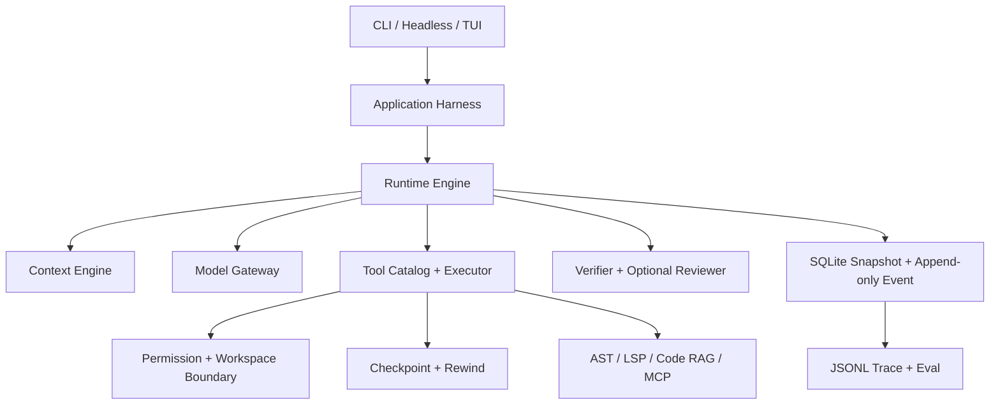

# Rivet

[](https://github.com/kernel0627/rivet/actions/workflows/ci.yml)

Rivet 是一个 terminal-native、可扩展、可恢复、可评估的 Python Coding Agent
Runtime。它负责模型之外的完整运行边界：Context、工具、权限、工作区安全、状态持久化、
Checkpoint/Rewind、验证、代码智能、Trace 和终端交互。

当前仓库已经实现 `PROJECT_DESIGN.md` 定义的单 Agent 正式 V1 主链，并提供 MCP
工具适配与可选 Reviewer 基线。2026-07-31 的本地离线验收结果为：

```text
194 passed, 10 subtests passed
Ruff: all checks passed
```

完整设计与验收基线见 [PROJECT_DESIGN.md](PROJECT_DESIGN.md)，实现矩阵见
[docs/implementation-status.md](docs/implementation-status.md)。

## 1. Quick Start

### 环境要求

- Python 3.10+
- Git
- 可选：ripgrep、Python LSP Server、Qdrant

### 安装

使用标准 Python 虚拟环境：

```bash
python -m venv .venv
source .venv/bin/activate
python -m pip install --upgrade pip
python -m pip install -e .
```

Windows PowerShell 使用：

```powershell
python -m venv .venv
.\.venv\Scripts\Activate.ps1
python -m pip install --upgrade pip
python -m pip install -e .
```

### 配置

```bash
cp .env.example .env
```

打开 `.env`，至少填写：

```dotenv
RIVET_PROVIDER=deepseek
RIVET_MODEL=deepseek-v4-flash
RIVET_API_KEY=your-api-key
```

Rivet 会自动读取所选工作区根目录的 `.env`；已经存在的系统环境变量优先于文件中的
同名变量。

已知 Provider 会自动选择官方 API 地址：

| `RIVET_PROVIDER` | 协议 Adapter | 默认地址 |
|---|---|---|
| `deepseek` | OpenAI Chat Completions | `https://api.deepseek.com` |
| `openai` | OpenAI Chat Completions | `https://api.openai.com/v1` |
| 其他名称 | OpenAI Chat Completions | 必须设置 `RIVET_BASE_URL` |

`RIVET_BASE_URL` 只用于代理、自建服务、Beta 地址或其他 OpenAI-compatible API，
并覆盖 Provider 的默认地址：

```dotenv
RIVET_BASE_URL=https://gateway.example.com/v1
```

API Key 的环境变量名可通过 `RIVET_API_KEY_ENV` 修改。密钥不会进入配置快照、
Event 或 Trace。

Provider Profile 还会处理协议差异。DeepSeek 使用 `max_tokens`，OpenAI 使用
`max_completion_tokens`；DeepSeek V4 thinking 工具调用返回的
`reasoning_content` 会随 Assistant Tool Call 持久化，并在后续请求中完整回传。

### 运行

在一个 Python 仓库中启动任务：

```bash
rivet run --workspace /path/to/project "修复失败测试并验证"
```

成功启动后，CLI 会输出 Run 状态、模型回答、工具调用和验证结果；需要授权或人工处理
时会输出 `run_id`、`pause_token` 与恢复条件。

希望先观察完整流程时，可以运行
[折扣计算 Bugfix 示例](examples/bugfix_task/README.md)。示例会引导你在临时目录中
完成问题复现、Agent 修改、权限恢复和最终验收。

## 2. 使用方式

机器可读模式：

```bash
rivet-headless --workspace /path/to/project "解释服务入口"
```

如果 Run 因权限、预算、Provider 或重复动作暂停，输出会包含 `run_id`、
`pause_token` 和恢复条件：

```bash
rivet resume --workspace /path/to/project RUN_ID PAUSE_TOKEN
```

授权某个已经 prepare 的动作：

```bash
rivet resume \
  --workspace /path/to/project \
  RUN_ID PAUSE_TOKEN \
  --permission PREPARED_DIGEST=allow
```

同一 Session 内连续工作：

```bash
rivet chat --workspace /path/to/project
```

后续 Run 会关联前一个 Run，并在 Context 中获得最近 Run 的目标、状态和最终回答。

## 3. 运行管理命令

```text
rivet run           启动一个 Run
rivet resume        恢复 PAUSED Run
rivet cancel        取消非终态 Run
rivet inspect       查看 Run Snapshot
rivet chat          在同一 Session 中连续创建关联 Run
rivet sessions      列出当前工作区的 Session
rivet runs          列出一个 Session 的 Run
rivet events        查询或按 JSONL 导出 Event Trace
rivet checkpoints   列出 Run 的 Checkpoint
rivet rewind        在无外部修改冲突时恢复 Checkpoint
rivet doctor        检查配置、状态位置、Git、ripgrep 和 Python LSP
rivet tools         列出模型可用的内置工具
rivet eval          运行固定离线 Eval，或显式使用真实 Provider
```

回退示例：

```bash
rivet checkpoints --workspace /path/to/project RUN_ID
rivet rewind --workspace /path/to/project RUN_ID CHECKPOINT_ID
```

Rewind 会先比对工具执行后保存的文件 hash。Checkpoint 之后发生过外部修改时，
命令返回 `RewindConflict`，不会覆盖用户的新内容。

## 4. 配置

优先级为：

```text
CLI overrides → environment → project config → user config → defaults
```

项目配置位置为 `.rivet/config.toml`；运行状态仍保存在项目外。示例：

```toml
[model]
provider = "deepseek"
model = "deepseek-v4-flash"
stream = true

[runtime]
max_turns = 30
max_model_calls = 60
max_tool_executions = 200

[permissions]
safe_read = "allow"
workspace_write = "ask"
process_execute = "ask"
network_access = "ask"

[retrieval]
enabled = true
sparse = true
dense = false  # Hash Dense 仅用于实验；接入真实 Embedding 后再显式开启
reranker = true
# qdrant_url = "http://127.0.0.1:6333"

[reviewer]
enabled = false
blocking_severities = ["error", "warning"]
```

启用 Qdrant 需要安装可选依赖：

```bash
python -m pip install -e ".[retrieval]"
```

启用 Python LSP definition、references、hover 和 diagnostics：

```bash
python -m pip install -e ".[lsp]"
rivet doctor --workspace .
```

未配置 Qdrant 时，Dense Retrieval 使用进程内确定性向量索引；Sparse 索引使用
SQLite。写入与 Rewind 后会自动刷新索引。

## 5. 架构



Runtime 是推进 Run 的唯一协调器。模型只返回文本或工具提案；工具必须依次经过：

```text
Pydantic 参数校验
→ prepare 和路径规范化
→ prepared digest
→ permission
→ 写操作 Checkpoint
→ Runtime 持久化 RUNNING
→ execute
→ 结构化 ToolResult
→ Verifier
```

整批工具只有在全部为 `READ + parallel_safe` 且预检通过时才并行。结果始终按原始
`ordinal` 进入下一轮 Context。

## 6. 安全与恢复

- 相对路径、绝对路径、`..` 和 symlink 逃逸由 Workspace Boundary 拦截。
- 搜索参数不会进入 ripgrep 的选项位置。
- 写操作必须具有权限决定和有效 Checkpoint。
- Execution Grant 只能消费一次。
- 命令使用 argv，不拼接 shell 字符串，并限制 cwd、环境、时间和输出。
- Provider、工具和 Trace 错误经过脱敏与长度限制。
- 崩溃恢复会协调非终态 ModelCall 和 ToolExecution。
- 执行中的非只读工具中断后标记 `UNCERTAIN`，阻止自动重放。
- 状态、日志、Artifact、索引和 Checkpoint 默认位于目标仓库外。

macOS 默认状态根目录：

```text
~/Library/Application Support/Rivet/workspaces/<workspace-key>/
```

可通过 `RIVET_STATE_HOME` 修改。

## 7. 代码智能与扩展

内置代码智能包括：

- 安全文本搜索；
- Python AST outline、symbol、import 和稳定 CodeSpan；
- Python LSP definition、references、hover 和 diagnostics；
- Sparse + Dense + RRF + Reranker；
- Qdrant Adapter；
- 内容 hash 驱动的增量索引和 Retrieval 指标。

MCP 工具会被转换为普通 Tool Catalog 项，继续经过 Schema、权限、超时、取消和
输出预算。仓库也提供 transport-neutral 的 Code Intelligence MCP Service Core，
便于接入 stdio、SSE 或 HTTP transport。Reviewer 在 Verifier 通过后读取任务、
diff 和证据；阻塞级问题会回到下一轮 Agent Context。

## 8. 开发与验证

```bash
python -m pip install -e ".[dev]"
python -m pytest -q
rivet eval --mode offline
ruff check src tests examples
python -m pip wheel --no-deps . -w /tmp/rivet-wheel
```

默认测试完全离线，不访问真实 Provider、Qdrant Server 或收费 API。OpenAI 和
Qdrant 使用本地 fake/contract adapter 测试；真实服务连通性属于部署环境验收。

仓库内置八个固定 Eval 场景，覆盖只读解释、符号定位、调用链、单文件与跨文件
Bugfix、新增测试、权限暂停恢复，以及工作区逃逸拒绝。默认离线模式使用脚本化模型，
适合 CI 和确定性回归：

```bash
rivet eval --mode offline --json
```

真实 Provider 模式复用同一批 Fixture 和验收条件，会产生网络请求和模型费用，需显式
执行：

```bash
rivet eval --mode live --config-workspace . --json
```

需要保留可复查的脱敏结构化证据时，使用 `--output`。报告以 `0600` 权限原子写入，
包含 Schema 版本、逐 Case 结果、实际 Provider/模型和错误分类，不包含 API Key：

```bash
rivet eval --mode offline --output reports/eval.json --json
```

需要观察本地 Runtime 和 Eval 基础设施的性能回退时，可以重复执行同一套离线场景：

```bash
rivet eval --mode offline --repeat 10 --json
```

当前机器的首次测量方法与结果见
[本地性能基线](docs/performance-baseline.md)。

对真实仓库运行离线索引与检索基准：

```bash
rivet benchmark-retrieval --workspace . --repeat 20 \
  --output /tmp/rivet-retrieval.json
```

当前 Rivet 仓库的规模、索引耗时、Sparse/Dense/Hybrid Top-5 命中和延迟见
[检索性能基线](docs/retrieval-baseline.md)。

## 9. 目录

```text
src/rivet/
├── application/       依赖装配与用例服务
├── domain/            持久化领域对象与不变量
├── runtime/           Run/Turn 协调、恢复和停止策略
├── model/             Provider-neutral Gateway 与 Adapter
├── context/           Context Budget、Compaction、Working Memory
├── tools/             Tool Schema、Catalog、两阶段 Executor
├── workspace/         边界、命令、Patch、Checkpoint、Rewind
├── state/             SQLite Store、Artifact 和外部状态布局
├── code_intelligence/ AST、LSP、Sparse/Dense/Hybrid Retrieval
├── verification/      确定性验证
├── reviewer/          可选的模型审查
├── mcp/               MCP Tool Adapter 与 Code Intelligence Service Core
├── observability/     Event Stream、Trace 和脱敏
├── evaluation/        Retrieval、Trajectory、Completion、Safety
└── interfaces/        CLI、Headless 和 TUI
```

项目只保留正式 V1 实现。公共入口统一使用 `rivet.application`、
`rivet.runtime.RuntimeEngine` 和 `rivet.interfaces`，不会同时维护另一套原型 API。

## 10. 当前限制

- 正式 V1 重点支持 Python 仓库；更多语言和 Tree-sitter 仍属于后续扩展；
- 真实 Provider 的凭据、配额、网络和模型行为需要在部署环境单独验证；
- Qdrant Adapter 已通过离线契约测试，TLS、认证和大规模容量仍需真实服务验收；
- LSP 能力取决于本机已安装且兼容的 Python Language Server；
- 当前已有 Rivet 中型仓库的离线索引与检索基线；更大型仓库、Token 和真实任务成功率
  尚未形成公开基线；
- 当前 Runtime 是单 Agent 架构，Multi-Agent 与 A2A 不在 V1 范围内。

这些限制的当前状态与后续路线见
[实现状态与验收矩阵](docs/implementation-status.md) 和
[开发路线](docs/roadmap.md)。

## 11. 参与开发

开发环境、架构约束和提交检查表见 [CONTRIBUTING.md](CONTRIBUTING.md)。
Pull Request 至少需要通过 Python 测试矩阵、固定离线 Eval、Ruff 和 wheel 构建。

## 12. License

Rivet 使用 [MIT License](LICENSE)。
